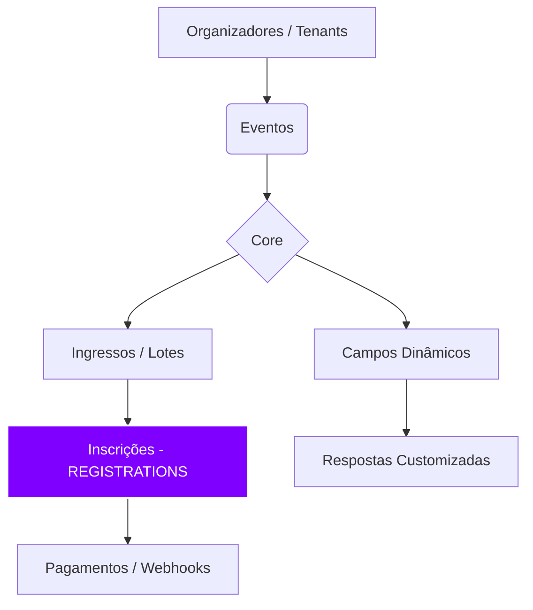

O seu `README.md` já está muito bem estruturado tecnicamente, mas podemos dar um "tapa" no visual para que ele pareça um produto de elite. Para um SaaS como o **event-pulse**, o segredo é usar ícones consistentes, seções bem divididas com linhas horizontais e um toque de modernidade.

Aqui está uma versão otimizada com foco em **legibilidade e impacto visual**:

-----

# 🚀 event-pulse | SaaS de Inscrições

> **Status:** 🟢 Fase 1 Concluída (Arquitetura & Segurança)

O **event-pulse** é uma plataforma multi-tenant de alta performance projetada para gerenciar inscrições em eventos de forma segura, escalável e intuitiva. Inspirado na fluidez de checkouts modernos, o sistema foca em conversão e proteção de dados (LGPD).

-----

## 🛠️ Stack Tecnológica Recomendada

| Camada | Tecnologia |
| :--- | :--- |
| **Frontend** | Next.js 14, React, Tailwind CSS |
| **Backend** | Node.js / NestJS (TypeScript) |
| **Banco de Dados** | PostgreSQL |
| **Segurança** | Criptografia AES-256 |
| **Cache/Queue** | Redis |

-----

## 📋 Entregáveis da Fase 1

### 🗄️ Arquitetura de Dados

O coração do sistema foi desenhado para suportar milhões de registros com latência mínima.

  * **Esquema Relacional:** 8 tabelas core (Organizations, Events, Tickets, etc.).
  * **Escalabilidade:** Estratégia de particionamento e índices otimizados.
  * **Flexibilidade:** Suporte a campos dinâmicos via JSONB.

### 🔐 Segurança & LGPD

Implementação de "Privacy by Design" desde o primeiro commit.

  * **Criptografia:** CPFs protegidos com AES-256 em repouso.
  * **Audit Log:** Rastreabilidade completa de todas as operações sensíveis.
  * **Isolamento:** Multi-tenancy rigoroso via Row-Level Security (RLS).

-----

## 🏗️ Arquitetura do Sistema



-----

## 📊 Performance Estimada

| Operação | Tempo | Volume de Dados |
| :--- | :--- | :--- |
| Busca por CPF | **\< 10ms** | 10 Milhões de registros |
| Validação de Estoque | **\< 5ms** | Com Row-level lock |
| Listagem de Inscritos | **\< 100ms** | 100k inscrições |

-----

## 🚀 Como Iniciar

### 1\. Preparar o Banco

```bash
# Criar o banco
createdb event_pulse_db

# Executar o script inicial
psql -U postgres -d event_pulse_db -f 01_init_database.sql
```

### 2\. Configurar o Projeto (Semana 1)

```bash
# Iniciar repositório
npm init -y
npm install express typeorm pg dotenv
cp .env.example .env
```

-----

## 🔄 Próximas Fases (Roadmap)

### **Fase 2: Backend API** ⚙️

  - [ ] **AuthService:** Login/Registro via JWT.
  - [ ] **RegistrationService:** Motor de inscrições (Core).
  - [ ] **PaymentService:** Integração com Stripe/Mercado Pago.

### **Fase 3: Frontend & UX** 🎨

  - [ ] **Admin Dashboard:** Gestão completa de eventos.
  - [ ] **Modal de Inscrição:** Stepper de 3 etapas otimizado para mobile.
  - [ ] **Landing Pages:** Geração dinâmica de páginas de evento.

-----

## 📚 Documentação Disponível

  * [Guia de Arquitetura](https://www.google.com/search?q=./01_DATABASE_ARCHITECTURE.md)
  * [Manual de Segurança](https://www.google.com/search?q=./03_SECURITY_AND_ENCRYPTION.md)
  * [Migrations TypeORM](https://www.google.com/search?q=./02_typeorm_migrations.ts)

-----
